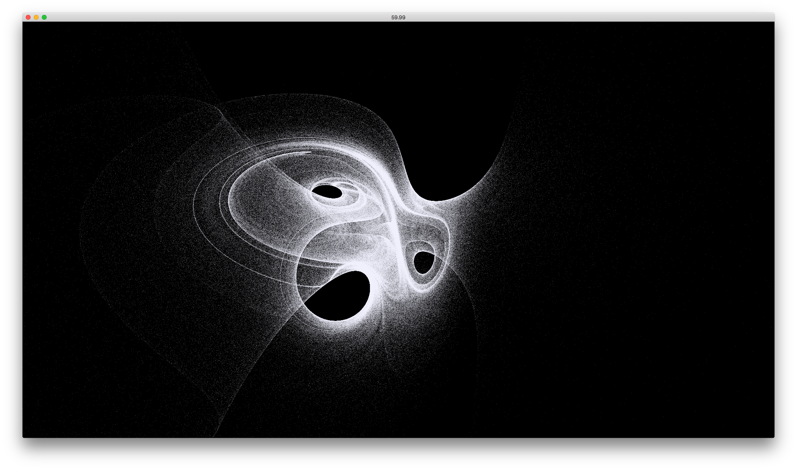

# ofxFastParticleSystem
 
OpenFrameworks addon for GPU particle system written in GLSL with the possibility to use different update shader.

Based from the great [ofxGpuParticleSystem](https://github.com/neilmendoza/ofxGpuParticles).

With ofxFastParticleSystem we add the possibility to use separate udpate and draw shader to be more clear and scalable using separate shaders files.

This addons is the core for our interactive multimedia performance [Dökk](http://fuseworks.it/en/project/dokk-en/).

## Compatibility

Tested with OpenFrameworks 0.9.8 and 0.10.0.

## Examples

See the examples:

- example-SimpleRandom
- example-StrangeAttractor

### example-SimpleRandom

In this exapmle you can see how declare a particle system with two separate update shaders and one draw shader. You can add how many update and draw shaders you need.

This is just an example to show you how use ofxFastParticleSystem.

#### How to use

You can change the update shader pressing *0* or *1*.

#### 1) Declare a const string to identify your shader

```c++
const string CIRCLE = "circle";
```

#### 2) Add shader to particle system

To add an update shader:

```c++
addUpdateShader(string shaderName, string key)
```

To add a draw shader:

```c++
addDrawShader(string shaderName, string key)
```

To add our *CIRCLE* update shader:

```c++
particles.addUpdateShader("shaders/updateParticlesCircle", CIRCLE);
```

#### 3) Retrive update shader

On the update methed retrive the update shader you want use. If you don't specify the *shaderKey*, default update shader is used:

```c++
ofShader &shader = particles.getUpdateShader(CIRCLE);

shader.begin();
shader.setUniform2f("center", ofGetWidth() / 2.0, ofGetHeight() / 2.0);shader.setUniform1f("radius", 300);
shader.setUniform1f("centerStiffness", 0.01);
shader.setUniform1f("maxSpeed", 20);
shader.end();
```

#### 4) Call update method

```c++
particles.update(CIRCLE);
```

#### 5) Retrive draw shader

Like for udpate shader you have to retrive your draw shader:

```c++
ofShader &shader = particles.getDrawShader();
```

#### 6) Retrive draw shader

To draw your particle system you have to call the draw method

```c++
particles.draw();
```

---

### example-StrangeAttractor

In this example you can see a interesting visualizazion with several million of particles.

You can interact with the particle system with mouse x position.

